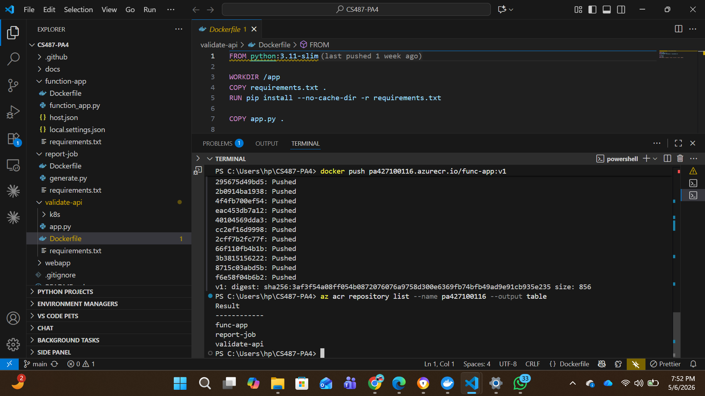
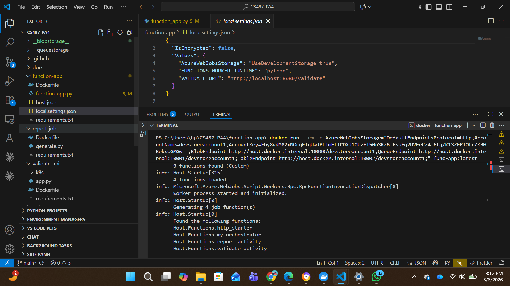
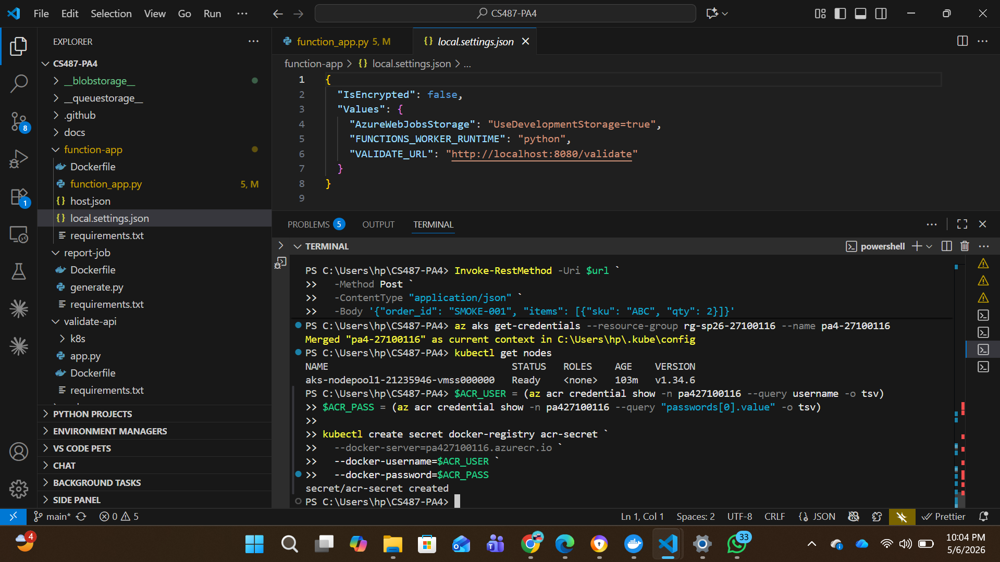
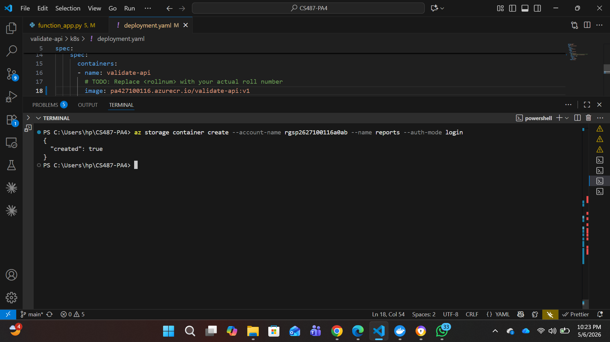

**Task-7 Resource Group**

---

**Screenshot 2026-05-06 231801**

---

**Screenshot 2026-05-06 232335**

---

**Screenshot 2026-05-06 232350**

---

**Screenshot 2026-05-06 232509**

---

**Task-1 Forked Repo**

---

**Task-1 Git Actions**

---

**Task-1 Web App**

---

**Task-1 Web_App**

---

**Task-2 .function-app**

---

**Task-2 curl**

---

**Task-2 report-job Dockerfile**

---

**Task-2 Validate-API dockerfile**

---

**Task-2**

---

**Task-3**

---

**Task-4 v1**

---

.png>)

**Task-5 (1)**

---

.png>)

**Task-5 (2)**

---

.png>)

**Task-5 (3)**

---

.png>)

**Task-5 (4)**

---

**Task-5 get pods**

---

**Task-5 kubectl**

---

**Task-5 Validate_URL**

---

**Task-5**

---

.png>)

**Task-6 (1)**

---

.png>)

**Task-6 (2)**

---

**Task-6 ACR**

---

**Task-6 Blob**

---

**Task-6 PDF**

---

**Task-6 Report**

---

**Task-6 Show and Log**

---

**Task-6 Storage**

---

**Task-6**

---

## 1. Service Selection

**App Service:** App Service is the ideal platform for hosting the frontend web UI because it is a fully managed PaaS offering that abstracts away infrastructure maintenance. It provides built-in auto-scaling for handling fluctuating user traffic to the web interface. From a cost perspective, it operates on predictable, tier-based monthly pricing, making it easy to budget for a persistent web frontend.

**Durable Functions:** Durable Functions were selected because the system requires a workflow orchestrator to manage multiple sequential steps (validation, then reporting) asynchronously. It operates on a consumption plan, meaning we only pay for the exact compute time used during execution, which is highly cost-effective for sporadic background tasks. Furthermore, its operational model inherently supports state-checkpointing and long-running processes without tying up HTTP connections.

**Azure Kubernetes Service (AKS):** AKS is the right tool for the validate microservice because it requires a stable, always-on endpoint to quickly process synchronous validation requests. The operational model provides fine-grained control over networking, container orchestration, and horizontal pod autoscaling. Because compute nodes run continuously, it is cost-effective only for persistent workloads that require consistent uptime rather than intermittent batch jobs.

**Azure Container Instances (ACI):** ACI is perfectly suited for the report-job because the report generator is a short-lived, one-shot batch task. ACI bills per second only while the container is actively running, completely eliminating the waste of idle compute resources. Treating this as a dynamically spun-up ACI rather than a permanent pod on AKS ensures we only pay for the 20–60 seconds it takes to generate a PDF.

---

## 2. ACI vs. AKS: Hands-on Comparison

**What happens to AKS when it is idle for 10 minutes?**
When the pipeline is idle for 10 minutes, the AKS worker nodes (Virtual Machine Scale Sets) continue to run. The validate pod sits idle, consuming its reserved CPU and memory, but the underlying infrastructure incurs a continuous, fixed hourly compute cost regardless of whether it is processing zero orders or a hundred.

**What does "idle" even mean for ACI in your pipeline?**
In this pipeline, there is no concept of an "idle" ACI. The ACI is created programmatically at runtime by the Durable Function, executes the script to write the PDF to Blob Storage, and then terminates. If there are no orders in the system, there are zero ACI instances deployed, meaning idle cost is exactly zero.

**If a malicious user spammed the Submit button 1000 times in a minute, which service would incur the most cost, and why?**
The ACI (Azure Container Instances) would incur the most drastic cost spike. Spamming 1000 orders would prompt the orchestrator to dynamically spin up 1000 individual ACI instances. Because ACI scales out linearly and bills per second for every individual container's CPU and memory, the cost would multiply rapidly. Conversely, AKS would simply process the 1000 lightweight HTTP requests using the compute resources we are already paying for (assuming it does not exceed the node pool's maximum capacity).

---

## 3. Durable Functions: Why Not Just HTTP?

If this pipeline were implemented as two plain HTTP-triggered functions calling each other, the architecture would immediately break down due to timeout limits. Standard HTTP load balancers typically time out connections after 230 seconds; since the report step can take up to a minute, a synchronous HTTP chain would likely drop the connection and return an error to the UI before finishing.

Furthermore, plain HTTP functions lack state persistence and automated retries. If the ACI creation failed mid-process, an HTTP function would lose the state of the order entirely, requiring us to build custom databases and queueing mechanisms to resume or retry the failed job. Durable Functions natively checkpoint state to Azure Storage and allow us to write simple try/catch retry logic without losing track of the workflow.

---

## 4. Cost Review

[Insert your screenshot here of Cost Management → Cost Analysis scoped to your resource group rg-sp26-27100116]

**Cost Estimation & Breakdown:**
In the instructor's subscription, the single most expensive resource for this assignment is the Azure Kubernetes Service (AKS) Cluster (specifically the underlying Virtual Machine Scale Sets in the managed node resource group). Because AKS requires dedicated VMs to be running 24/7 to maintain the cluster and the validate-service pod, it continually racks up compute charges. In contrast, the Function App and ACI are consumption-based, and the basic App Service tier is a relatively low fixed cost.

---

## 5. Challenges Faced

The grader values honesty over a perfect run, and I encountered several significant roadblocks during deployment:

**Function Key Retrieval and Storage Authentication Issues:**
During Task 7, I was completely unable to retrieve my Function App keys (default and _master). The Azure Portal threw an "Error while loading system keys." Through debugging, I found this was linked to a `KeyBasedAuthenticationNotPermitted` error—the storage account's security policy blocked shared-key access while the Function runtime was trying to use a Managed Identity. Because the UI and CLI both failed to yield the key, I bypassed the issue entirely by modifying the function.json file to change the `http_starter` authorization level to `"anonymous"`, allowing me to wire the Web App without the `?code=` URL parameter.

**PowerShell String Escaping & JSON Parsing with ACI:**
While manually testing the ACI deployment in Task 6, the `az container create` command repeatedly failed. PowerShell's parser was silently stripping the inner double quotes from the `ORDER_JSON` environment variable string. I debugged this by pulling the `az container logs`, which revealed a Python `JSONDecodeError`. I attempted to fix this by using a `container.json` configuration file, which then triggered a cascading series of errors regarding missing `osType`, region conflicts (`ukwest` vs. `uksouth`), and missing ACR credentials. Ultimately, I resolved it by wrapping the JSON payload securely in a PowerShell variable before passing it to the CLI, and ensuring the Managed Identity was explicitly attached via the `--assign-identity` flag to fix IMDS connection timeouts.

**Web App DNS Resolution Failure:**
When first testing the end-to-end pipeline, the web UI threw an `ENOTFOUND` error. I realized the `FUNCTION_START_URL` had been configured with the shortened default domain name. I debugged this by checking the App Service configuration and updating the URL to use the fully qualified domain name (FQDN), which included the generated routing hash.
